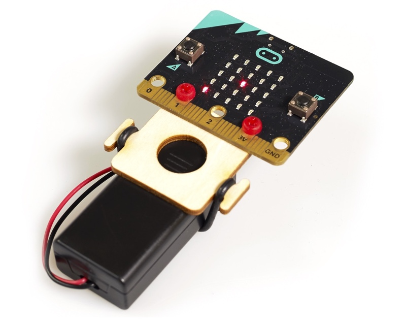
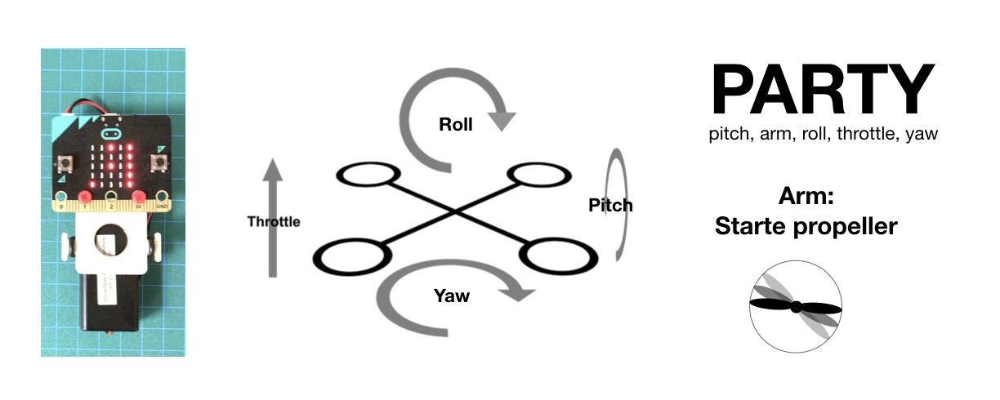
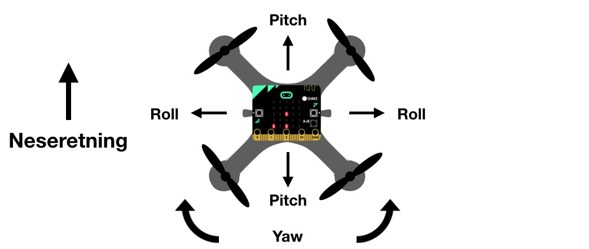
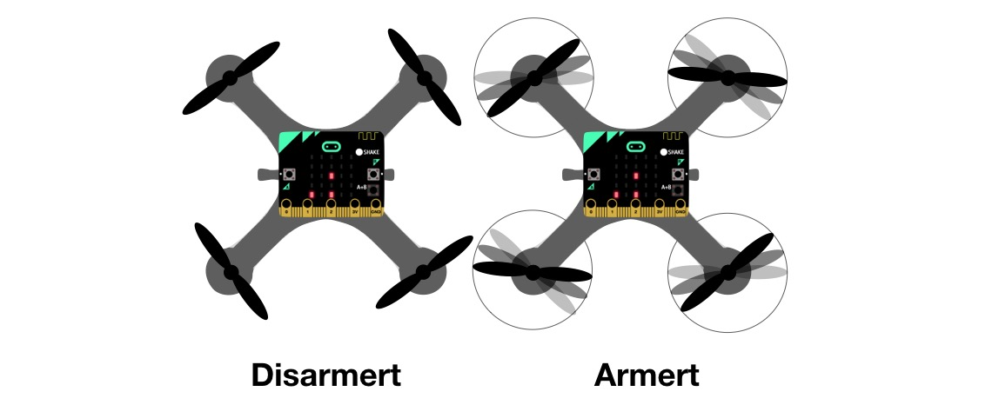
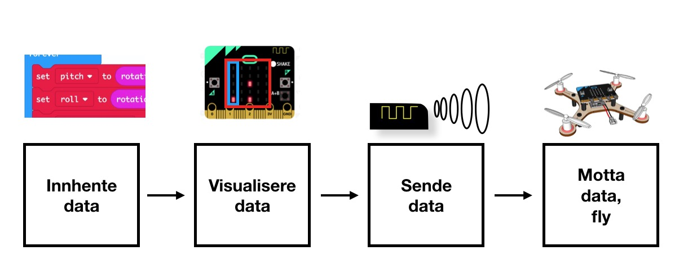
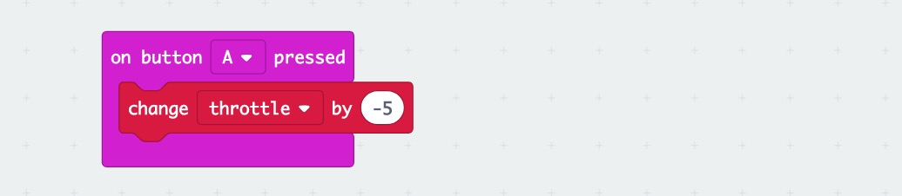
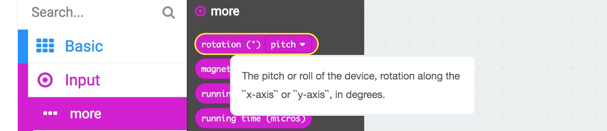
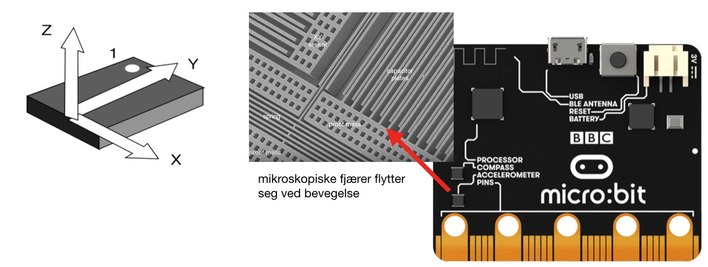
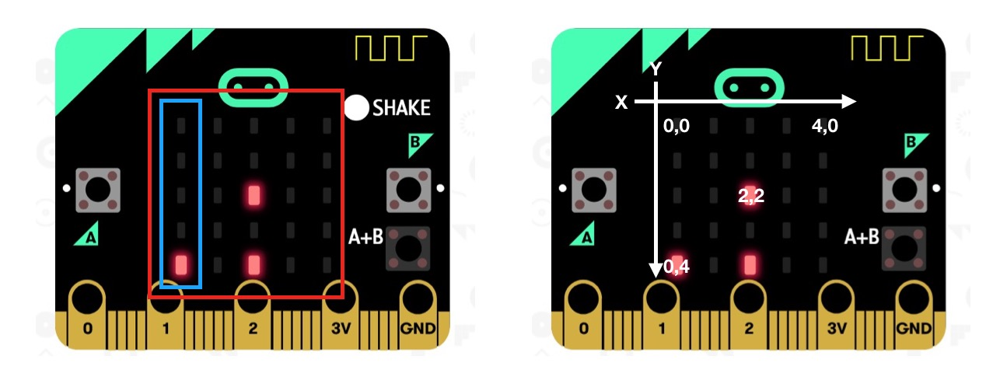
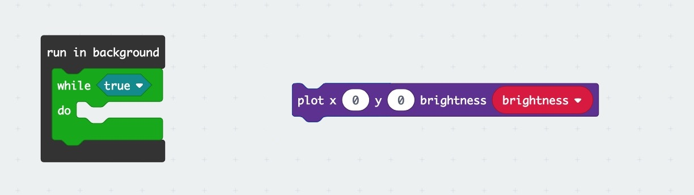

# Introduksjon {.intro}

I denne oppgaven lar vi micro:bit bli en fjernkontroll som kan styre en drone. Prinsippene kan også brukes til å styre andre kjøretøy som krever presis kontroll.

## Flyretninger

For å styre en drone må vi først forstå `flyretningene`:

__Throttle__ bestemmer hvor fort motorene skal rotere i felleskap. Det øker løftekraften til dronen. Vår drone har `throttle` som prosent:

- 0% betyr at dronen forblir på bakken
- 50% er omtrent det dronen trenger for å lette
- 100% gjør at dronen kræsjer i taket

Derfor er det viktig sende riktig mengde `throttle` til dronen. Det enkleste er å starte på 0 og øke mengden til vi nærmes oss 50%

 __Roll og pitch__ endrer dronens vinkel og måles i grader. Når vinkelen ikke lenger er vannrett, vil noe av skyvekraften gå sidelengs og dytte dronen den retningen. Vi skal begrenset helningen mellom -45 og 45 grader for at bevegelsene ikke skal bli for voldsomme. Tallene gir følgende bevegelse:

 - `Roll` til -45: Raskt til venstre
 - `Roll` til 0: Ingen sidelengs bevegelse
 - `Roll` til 45: Raskt til høyre
 - `Pitch` til -45: Raskt forover
 - `Pitch` til 0: ingen bevegelse forover/bakover
 - `Pitch`til 45: Raskt bakover

 __Yaw__ (Uttales "jå" på britisk) får dronen til å rotere sidelengs om sin egen akse. Dersom vi satt oppå dronen med ansiktet framover, ville vi da rotere som på en kontorstol. Dette kalles neseretingen. Yaw endrer neseretningen på følgende måte:

 - `Yaw` til 0, ingen rotasjon
 - `Yaw` til - 30, roterer mot klokka
 - `Yaw` til 30, roterer med klokka

 Jo større tall, jo raskere rotasjon. Du kan selv bestemme hastigheten ved å bruke mindre eller større tall.

 La oss se det ovenfra:

 

`Arm` eller armering, betyr å aktivere dronen. De aller fleste flyvende droner (multikoptere) har armering. Dette er en sikkerhetssperre som gjør at propellene ikke kan spinne før vi er klare for det. Store droner har kraftige propeller som kan skade oss ved nærkontakt, så man forlater dronen før man armerer den.

`Disarm`eller disarmering betyr å stoppe motorene. Dette gjør vi etter at vi har landet, eller ved en nødsituasjon (kræsj)

- Vi setter arm til 0 fram til vi er helt klare til å fly
- Vi setter arm til 1 for å starte propellene
- Om vi kræsjer, bør vi umiddelbart disarmere slik at propellene ikke slår inn i ting. Da setter vi `arm` til 0 igjen.

Kodingen har fire hoveddeler og de fem variablene følger hele veien.

## PARTY {.tip}
De fire flyretningene pluss armeringen kan vi huske som __PARTY-regelen__: Pitch, Arm, Roll, Throttle, Yaw.

## Før vi starter kodingen {.check}
- [ ] Gå til [makecode.microbit.org](https://makecode.microbit.org) (Chrome nettleser)
- [ ] Lag et nytt prosjekt og gi den navn med din radiogruppe, f.eks Drone Sender Gruppe 0 (alle må velge en unik radiogruppe slik at man ikke styrer andres drone)
- [ ] Vi bruker command + c og command + v (Mac) eller ctrl + c og ctrl + v (PC) for å kopiere og lime inn blokker
- [ ] Vi sletter en blokk enklest med å bruke backspace-tasten
- [ ] Vi bruker engelsk blokkspråk i denne veiledningen. Klikk på tannhjulet og velg "Language" dersom blokkene er på norsk.

## Tips til kodingen {.tip}
- Vi skal kun ha en `forever`-løkke. To løkker gjør det umulig å vite hvilken kode som kjøres først
- Når vi flyr dronen, må vi unngå å ha noe i forever-løkken som kan forsinke den. Dette betyr i praksis at blå blokker som starter med `show` må droppes. Det er ok å bruke de i `on start` eller midlertidig bruke  `show number` for for å teste koden.
- Bruk kun en `show number`. Ellers klarer vi ikke skille mellom tallene.

# Steg 1: Innhente data {.check}

 - [ ] Vi starter med å opprette variablene i PARTY-regelen: Pitch, Arm, Roll, Throttle, Yaw.

 - [ ] Vi bruker A- og B-knappen til å endre throttle. For å slippe å klikke 50 ganger for å få throttelen opp i passelig mengde, øker vi med 5 for hvert klikk. Knapp A kan brukes til å minke, og knapp B kan brukes til å øke.
 

 - [ ] For å kunne finstille throttelen, samt unngå at vi øker for raskt når dronen begynner å lette, lønner det seg å kun endre med 1, når vi er oppe i en viss mengde. Erfaring viser at dette tallet bør være 40. Altså hvis throttle er under 40, øker eller minker vi med 5, hvis ikke, skal vi kun øke eller minke med 1.

  - [ ] Throttelen skal ikke få lov til å være mindre enn 0 eller mer enn 100. Dersom den er under 0, skal vi sette den til 0. Dersom den er over 100, setter vi den til 100.

## Test throttlen {.flag}
 __Test om dette virker i simulatoren ved å bruke `show number(throttle)`, gjerne i `forever`-løkken:__

 - [ ] Throttle kan ikke bli mindre enn 0

 - [ ] Throttle kan ikke bli mer enn 100

 - [ ] Throttle øker og minker med 5 så lenge den er under 40. Hvis ikke endres den med 1.

## Roll og pitch {.activity}

Vi kan bruke micro:bitens aksellerometer til å måle vinkel i forhold til bakken. Dette måles i grader, og vi får tak i vinklene med blokken `rotation pitch`, som også kan kopieres og endres til `rotation roll`.

når micro:biten ligger vannrett, vil både roll og pitch være 0. Dette er akkurat det vi trenger for å styre dronen vår. Vi må oppdatere roll og pitch hele tiden.

- [ ] I`forever-løkken` mater vi inn variablene `roll` og `pitch` med `rotation roll` og `rotation pitch` (altså set roll to rotation roll osv)

## Hvordan virker aksellerometeret? {.tip}

Sensoren ser du på baksiden av micro:biten. Den har mikroskopiske fjærer som flytter på seg ved bevegelse. Tyngdekraften får ting til å akselerere mot bakken. Derfor kan akselerometeret også måle hvilken vei bakken er. Den måler bevegelse i tre retninger og bruker [Eulers formel](https://en.wikipedia.org/wiki/Euler_angles) for å beregne roll og pitch oss.

# Steg 2: Visualisere verdiene {.activity}

Å visualisere verdiene er en effektiv måte å vise variablene våre på. Istedenfor å vente på at flere tall skall scrolle over skjermen, kan vi bruke pikslenes plassering til å indikere alle __PARTY__-variablene samtidig. Istedenfor nøyaktige tall får vi indikasjoner på hva de er, nok til å se om vi har kodet riktig.

__Se på skjermen til venstre:__

- Innenfor det blå feltet kan vi flytte prikken oppover. Jo mer throttle, jo høyere går prikken.

- Innenfor det røde feltet kan vi flytte en prikk som både viser  `roll` og `pitch`. Vi flytter den sidelengs (x-aksen) for å vise roll, og opp/ned (y-aksen) for å vise roll.

- Nederst på skjermen kan vi vise en forenklet `Yaw`-verdi.

- Siden throttle svært sjelden vil være høy nok til å bruke den øverste pikselen (0,0), kan vi bruke denne til å vise om dronen er armert. Det finnes også andre måter å vise dette på, dersom man bruker displayet kreativt.

## Utfordring {.challenge}

Få en piksel til å blinke når vi har armert. Husk at du ikke kan bruke pause-funksjonen i forever-løkken. Derimot kan du få til noe ved å bruke blant annet disse blokkene:

Husk at all plotting må skje i forever-løkken.

## Test prosjektet på micro:bit {.flag}
__Prøv spillet på micro:bit. Forhåpentligvis fungerer det brillefint. Gratulerer, du har nå gjort ferdig spillet.__

Her kommer et par utfordringer!

## Utfordring {.challenge}

Legg til score og highscore som vises etter at du dør. Spill en liten melodi og vis New highscore hvis spilleren slo rekorden.

**Tips:** Du kan bruke lengden til snake-arrayen til å regne ut poeng.

## Utfordring {.challenge}

Styr slangen automagisk. Få den til å gå rundt og finne mat selv og prøve å ikke krasje.

**Tips:** Du har allerede skrevet kode som sjekker om slangen kjører utenfor eller kolliderer med seg selv. Du kan bruke den samme koden
til å sjekke posisjonen og endre retning(`direction`) mot høyre eller venstre hvis den krasjer, finne ny posisjon og sjekke om den også krasjer.
For å finne maten kan du snu mot den når du kommer på samme rad eller kolonne som maten.
